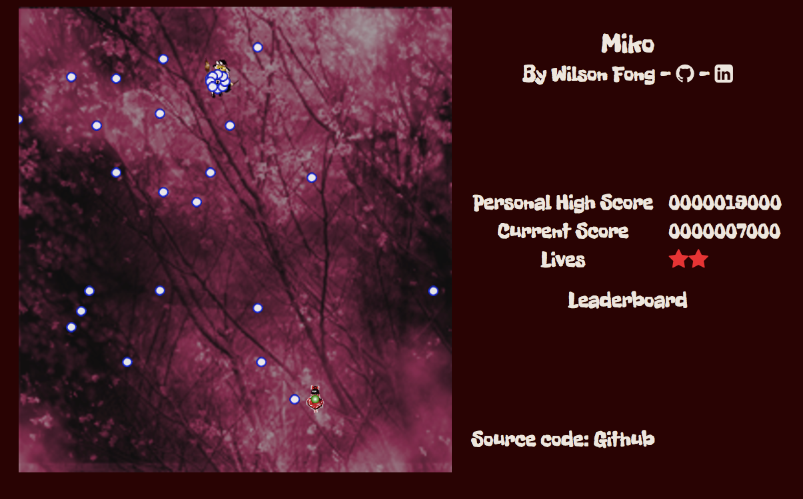

# Miko

[miko]: http://www.wilsonfong.me/miko
[Live site][miko]

## Background

Miko (shrine maiden) is a shooting game based off of Touhou, the popular Japanese bullet hell shooter.  It's written in JavaScipt and uses EaselJS for game rendering.

## How to Play

The goal of Miko is to weave through the barrage of enemy bullets for as long as possible before losing all of your lives.  Try to beat your personal high score.

Move your character using `←`, `↑`, `→`, and `↓`.  Shoot with `z` or `SPACE`.

## Features

### 2D Rendering

Miko utilizes EaselJS for 2D rendering.  Every object in the game canvas has an EaselJS `Container`.  This allows for easy update and removal of all EaselJS objects associated with a game object.

### Local Storage

The user's personal high score is stored using Web API's local storage.

## Future Features

- [ ] Global leaderboard
- [ ] Multiple difficulty levels
- [ ] Additional bullet patterns
- [ ] Additional enemy patterns
- [ ] Enemy item drops
